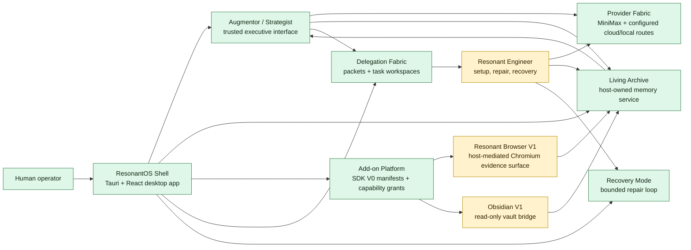
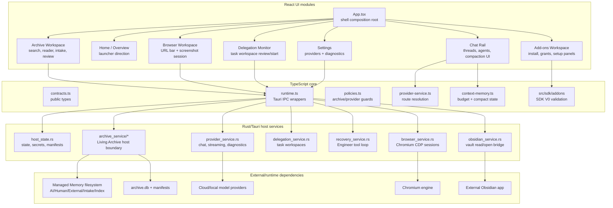
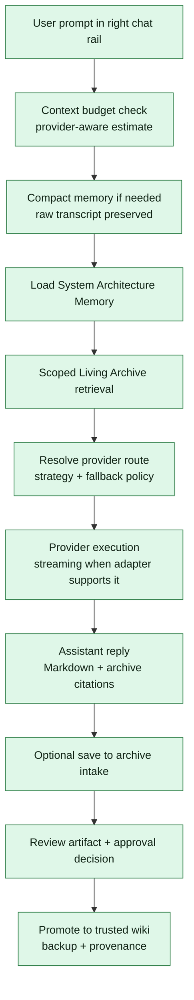
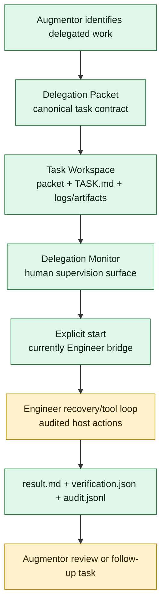
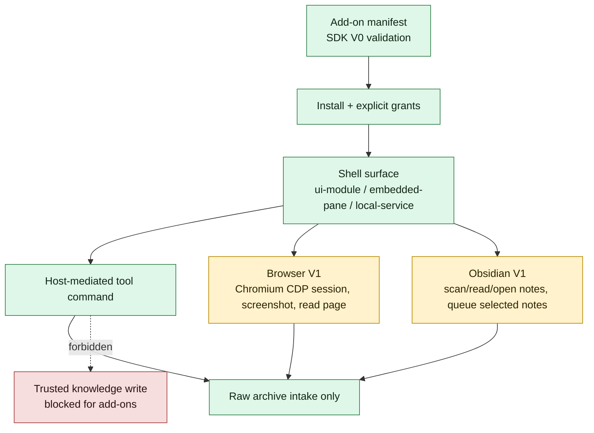

# ResonantOS vNext System Diagram

Last updated: 2026-04-27

This document summarizes how ResonantOS vNext currently works, which capabilities are already implemented, which parts are still under construction, and the next engineering moves. It is derived from the current docs, ADRs, module map, Tauri command surface, bundled add-on manifests, and frontend modules.

## Legend

- `Working now`: implemented in code and represented in the current UI or host command surface.
- `Under construction`: partially implemented, capability-gated, preview-only, or deliberately narrowed for safety.
- `Next`: documented target work that is not implemented yet.

## High-Level Operating Model

ResonantOS is not an OpenClaw dashboard. The shell is the product surface; OpenClaw, Hermes, Obsidian, OpenCode, Audio2TOL, Browser, Shield, Logician, and R-Awareness are add-ons or future add-ons behind explicit manifests and grants.

## Runtime Boundary

The binding rule is that privileged capabilities stay behind the Rust/Tauri host boundary. The React side can render state, collect intent, and call typed IPC wrappers; it should not own secrets, privileged filesystem writes, provider execution, browser process control, or trusted archive promotion.

## Main Workflows

## Capability Status

| Area | Working now | Under construction | Next steps |
| --- | --- | --- | --- |
| Shell | Tauri desktop app, left launcher rail, center workspace, top status, right chat rail, persisted local state. | Home is still evolving from overview/workbench into final app launcher. | Split reusable shell layout primitives, active add-on workspace state, full-screen workspace mode. |
| Chat and agents | Augmentor and Engineer selection, thread history, pin/delete/branch/rename, Markdown replies, interruption, streaming when supported. | Dictation, regenerate, attachments, and long-run compaction evaluation are incomplete. | Native microphone path, attachment pipeline, regenerate controller, stronger long-session tests. |
| Context memory | Raw transcript ledger, compact state extraction, manual and automatic compaction, context map UI, editable compact fields. | Provider-tokenizer exact accounting and review history for memory edits are not complete. | Provider-native context metadata, compaction provenance UI, long-session evaluation. |
| Provider fabric | Central route resolution, provider profiles, runtime nodes, diagnostics, smoke tests, MiniMax path, local/runtime/LAN node representation, and editable workload strategy routes with cost posture. | Creating/reordering named fallback chains, provider health history, and richer route explanations are incomplete. | Fallback chain builder, provider health history, OpenAI/Anthropic/Gemini/local runtime completion. |
| Living Archive | Host-owned status/search/read/intake/review/promotion, source scans, copy imports, system architecture memory, Audio2TOL bridge. | Mixed-library classification and reorganisation are preview/review only; move imports are disabled. | Audited reorganisation execution, rollback, sync/watchers, semantic merge, richer bulk review. |
| Memory domains | Human Knowledge, External Knowledge, AI Memory, and Mixed Library staging are documented and represented in import flows. | Local Git-style versioning and conflict handling are not complete. | Version history layer, merge/conflict UX, model-assisted classification beyond deterministic rules. |
| Delegation | Delegation Packet contracts, generated `TASK.md`, task workspace creation/list/read/finish, monitor UI, Engineer start bridge. | External add-on worker dispatch and artifact promotion are not enabled. | Lifecycle manager, artifact previews, archive-intake requests for approved results, broader worker runtimes. |
| Add-on SDK | SDK V0 types/validation, bundled manifests, capability consistency checks, sideload validation. | Sideload hardening, signed registry, service lifecycle, runtime isolation are incomplete. | Curated signed registry, developer docs, public SDK packaging, sidecar health/lifecycle manager. |
| Browser | Bundled manifest, capability gate, Chromium engine install/status, persistent session open/navigate/screenshot/read/close commands. | Evidence surface is screenshot/headless-control, not a true live embedded Chromium viewport. | Click/type/download tools, citation capture, authenticated workflow gates, CEF/browser-view decision. |
| Obsidian | Read-only vault bridge, note scan/read/open, Augmentor handoff, selected/batch raw-intake queueing with grants and confirmation. | No automatic watcher/sync and no embedded editing surface. | File watcher/scheduled sync, deeper embedded/editing integration, richer organization workflow. |
| Recovery | Recovery mode, route candidates, Engineer prompt loop, bounded host-mediated tools, red emergency UI. | Engineer is not yet a fully autonomous repair operator. | Action template, approved code-edit tools with audit logs, escalation, stronger recovery tests. |
| Security/Web3 | Architecture rules exist for wallet/security and capability gates. | Wallet/Web3 is not implemented. | Signing confirmation UI, custody tiers, secret/audit hardening before wallet work. |
| Productization | macOS Tauri build exists and latest snapshot reports tests/build passing. | Vite large chunk warning, cross-platform QA, onboarding, release/update flow remain open. | Code splitting, Windows/Linux validation, accessibility/touch QA, release governance. |

## Current Guardrails

- Add-ons can read scoped archive views and write raw intake artifacts only when granted; they cannot write trusted knowledge pages directly.
- Move imports and file reorganisations remain disabled until audited execution, explicit approval, rollback, and tests exist.
- Reorganisation plans are preview-only artifacts.
- Secrets, provider execution, browser control, archive promotion, filesystem privilege, and recovery tools stay behind host services.
- `App.tsx` remains the shell composition root; feature orchestration belongs in module controllers and host services.

## Recommended Next Engineering Sequence

1. Stabilize the shell launcher/workspace model from `docs/product/UX-001-resonantos-app-shell.md`.
2. Finish the add-on runtime lifecycle manager so Browser, Obsidian, OpenCode, Hermes, and OpenClaw follow one service model.
3. Add the audited Living Archive reorganisation execution path with preflight, human approval, rollback, and tests.
4. Upgrade Browser from evidence/control V1 to persistent visual control with safe click/type/read-page/download tools.
5. Extend provider strategy from editable workload routes to named fallback-chain creation/reordering, cost estimates, health history, and richer per-agent policy explanations.
6. Harden context memory with long-session evaluation, source-linked edit history, and provider-tokenizer integration.
7. Strengthen Engineer recovery into a controlled repair operator with audited edits, verification, and escalation.
8. Run cross-platform, accessibility, touch, packaging, and release-flow hardening before treating vNext as product-ready.
